# mpe32board-midi
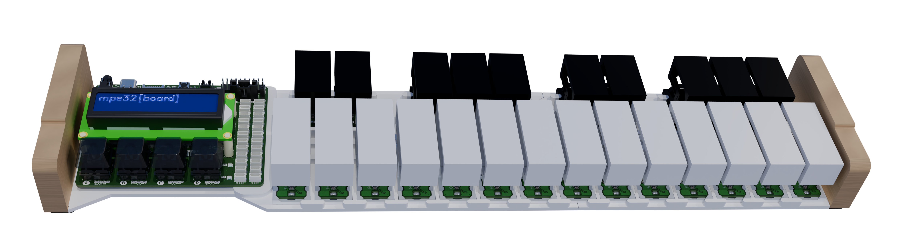
An expressive midi controller that has onboard sound processing with an expandable and hackable nature.
(v2 of [stm32pe-midi](https://github.com/udu3324/stm32pe-midi))

 * Built in DSP
 * Support for Programs and Sequencer
 * Hacker Header Exposed GPIO
 * Micro-SD Card Support
 * Onboard SDRAM for extended recording/memory

## Purpose
After making the [stm32pe-midi](https://github.com/udu3324/stm32pe-midi), I wanted to reflect at the problems I faced and the feature set I sacrificed out of it originally. I wanted to learn how ram works and the correct way to implement it, which I did for this project. I also wanted something that was more polished and structured better as the pcb dictated the rest of the design which lead to unfortunate design decisions. I instead designed everything in module-like components to allow more expansion and flexibility in the future.

## Zine Page
Some information is redacted on this export, DM me for the full version!
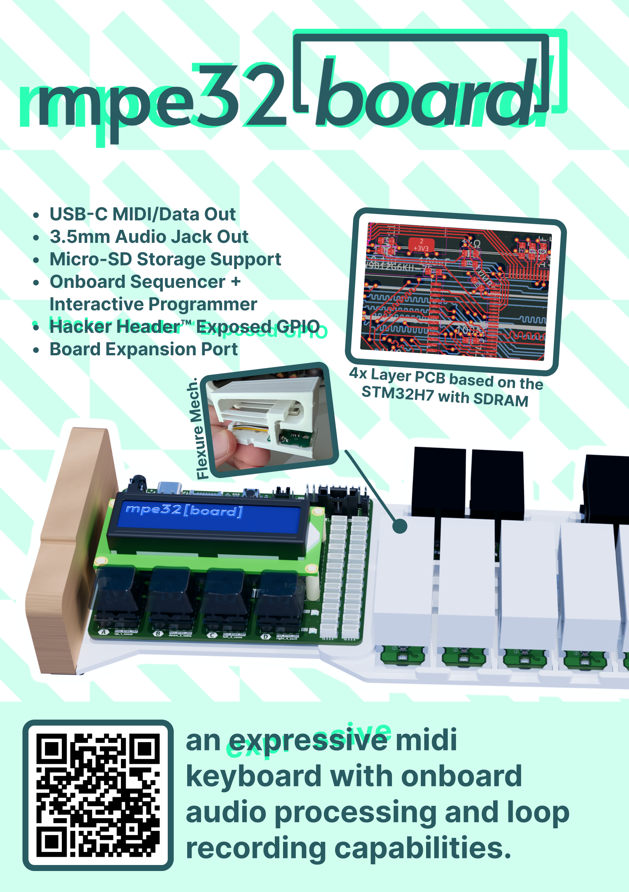

## Firmware
The firmware uses the stm32cubemx software to generate a .ioc of its pinout functions and its cmake gcc code template. I then chose Visual Studio Code as the choice of my IDE to code the rest in C/C++.

There is sample code [here](https://gist.github.com/udu3324/de9aada8e3ea0addc13870c6bbbebc0f) for trying out the mpe32sensors standalone on the Arduino platform.
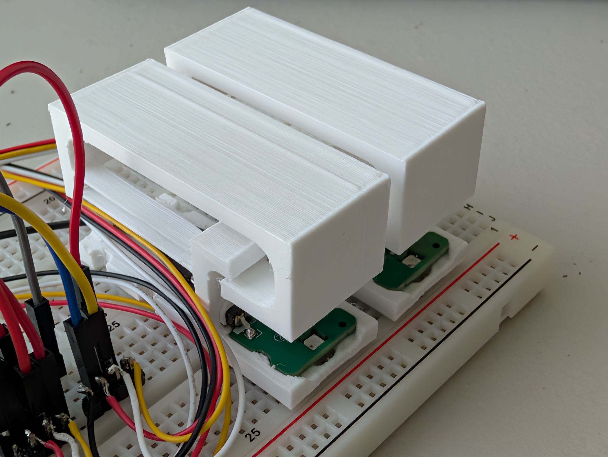

### Libraries Used
 * https://github.com/hathach/tinyusb
 * https://github.com/jtainer/i2c-mux
 * https://github.com/berndoJ/libneopixel32
 * https://github.com/devOramaMan/stm32_TMAG5273 (modified/fixed)

## CAD
### Case
The case is a 3 part 3d-printed case that is screwed together with m3 screws, both being self-tapped and heat-set inserts. There are two wood block accents (or plywood) on the side screwed in too.
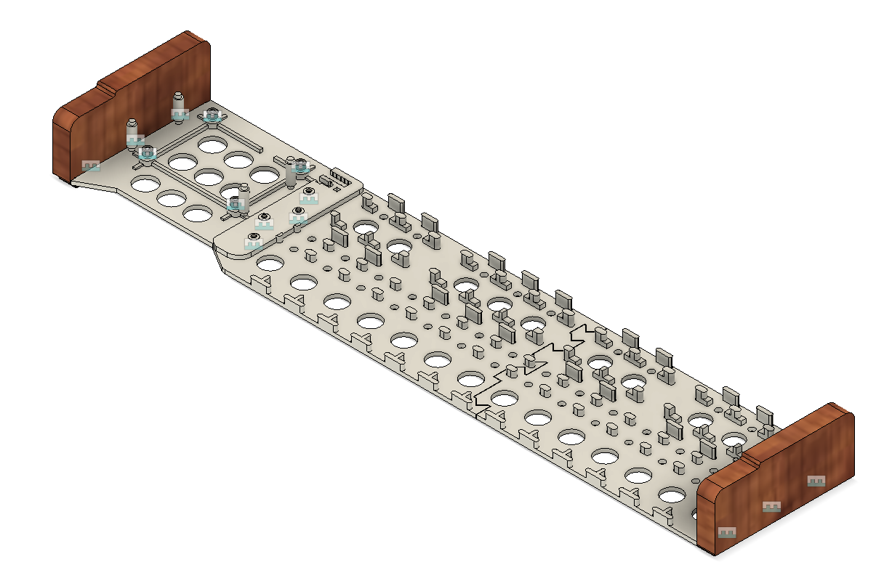

Each key is press fit and can also be screwed in with a m3 screw and nut if needed.
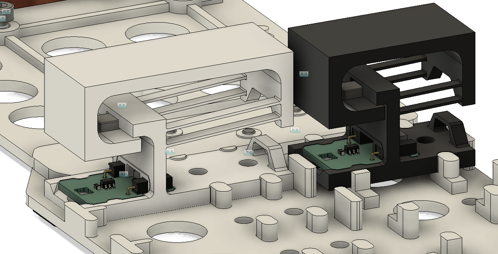

Due to my 3d-printer being too small, I have to cut the board in half to print. This is later adhered with uv-glue.
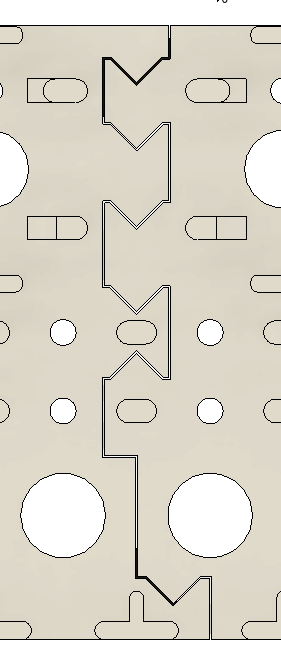

### Keys
The keys are compliant mechanisms that are designed to be 3d-printed with the least amount of post-processing. The flexure allows the key to move up and down as well as twist to allow pitch shifting.
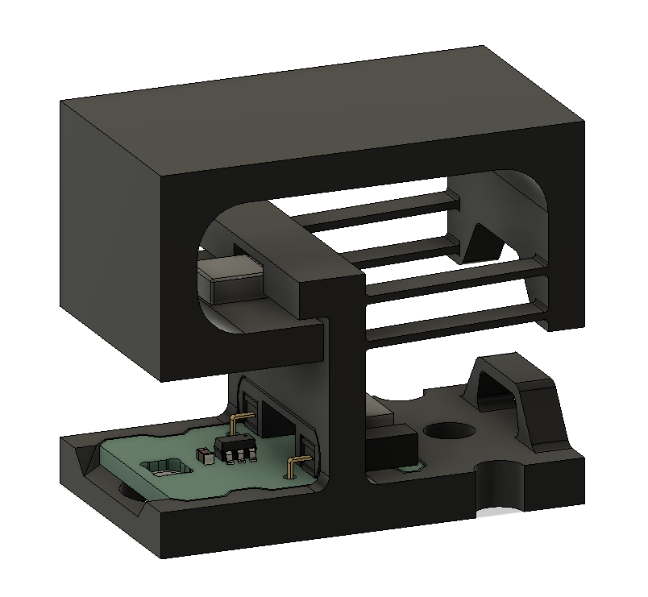
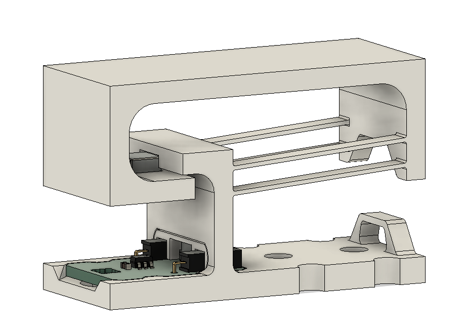

Another printed piece is included to hold down and fix the stm32sensor pcb in place.
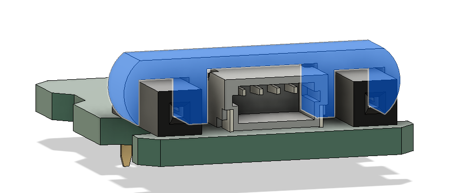

## PCB
I split my design into two boards. One being the "motherboard" called the stm32board which connects everything and has the mcu/ram/jtag for central control. The other is the sensor boards called the stm32sensor which connects through one of the 24 JST-SH-4x connectors that are on their own i2c line.

### stm32[board]
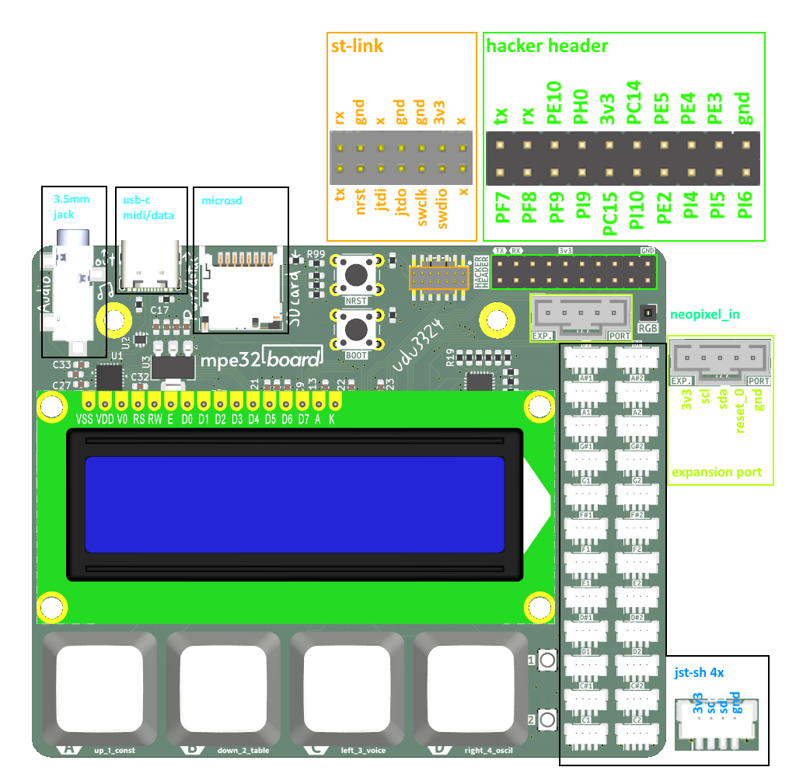

### stm32[sensor]
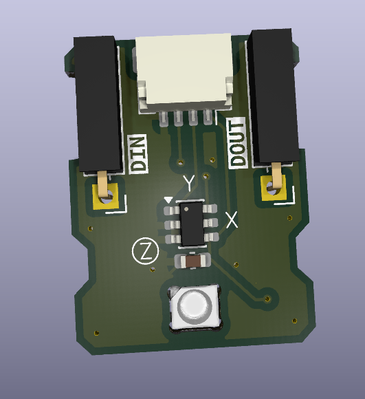
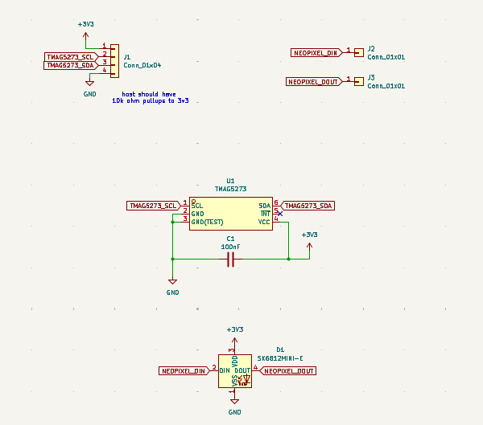

## BOM
The Bill of Materials can be viewed [here](https://docs.google.com/spreadsheets/d/1Ah6NNKW-CTIdOJtxNPdxd3ZnzDfgMl2LX2XapnXmrVo/edit).

### Build Steps
1. Get all materials ready and 3d printed
2. Post-process any 3d-prints if needed and insert heat set inserts for m3 screws
3. Assemble the pcb if not PCBA
4. Assemble all sensor boards into key housings and holder
5. Add LCD to stm32board and solder onto header
6. Assemble all keys and stm32board onto case, while also wire routing carefully
7. Screw on accent wood blocks
8. Flash firmware onto board
9. Done! Plug and play into your host device and favorite DAW
