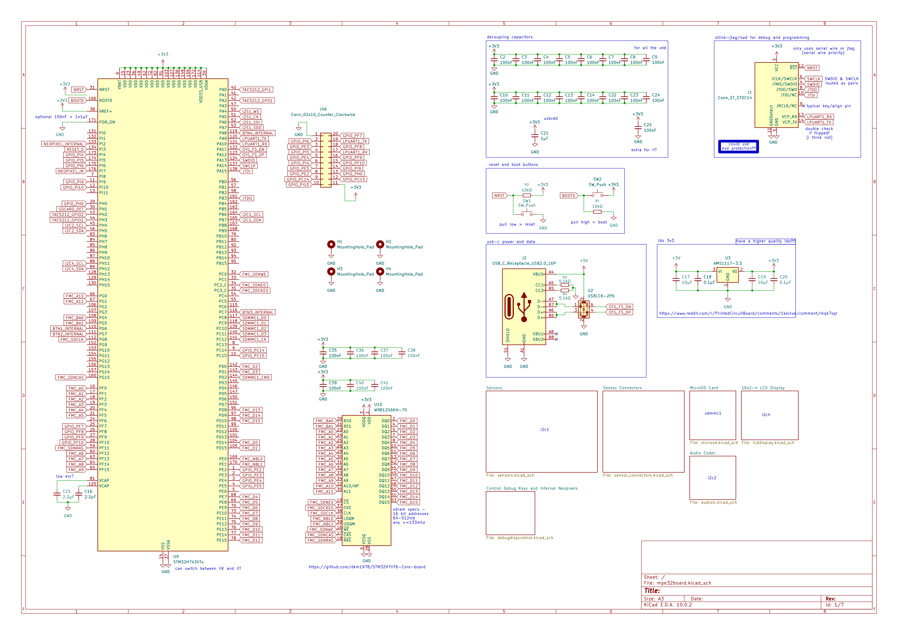
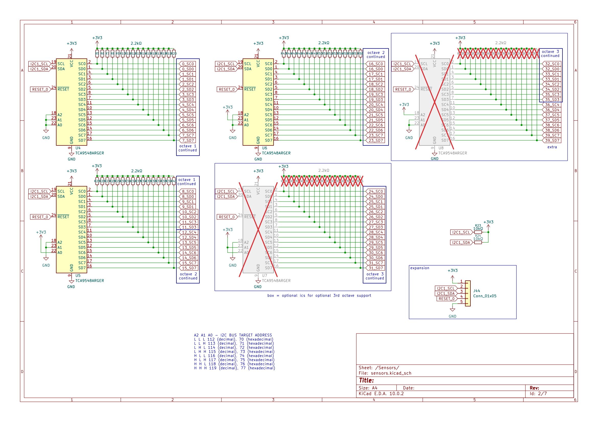

# mpe32board-midi

An expressive midi controller that has onboard sound processing with an expandable and hackable nature.
(v2 of [stm32pe-midi](https://github.com/udu3324/stm32pe-midi))

 * Built in DSP
 * Support for Programs and Sequencer
 * Hacker Header Exposed GPIO
 * Micro-SD Card Support
 * Onboard SDRAM for extended recording/memory

## Purpose
After making the [stm32pe-midi](https://github.com/udu3324/stm32pe-midi), I wanted to reflect at the problems I faced and the feature set I sacrificed out of it originally. I wanted to learn how ram works and the correct way to implement it, which I did for this project. I also wanted something that was more polished and structured better as the pcb dictated the rest of the design which lead to unfortunate design decisions. I instead designed everything in module-like components to allow more expansion and flexibility in the future.

## Zine Page
Some information is redacted on this export, DM me for the full version!

## Firmware
The firmware uses the stm32cubemx software to generate a .ioc of its pinout functions and its cmake gcc code template. I then chose Visual Studio Code as the choice of my IDE to code the rest in C/C++.

### Libraries Used
 * https://github.com/hathach/tinyusb
 * https://github.com/jtainer/i2c-mux
 * https://github.com/berndoJ/libneopixel32
 * https://github.com/devOramaMan/stm32_TMAG5273 (modified/fixed)

## CAD

## PCB
I split my design into two boards. One being the "motherboard" called the stm32board which connects everything and has the mcu/ram/jtag for central control. The other is the sensor boards called the stm32sensor which connects through one of the 24 JST-SH-4x connectors that are on their own i2c line.
### stm32[board]

### stm32[sensor]

