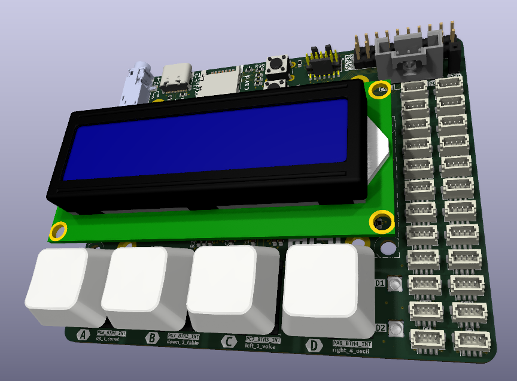

# mpe32board-midi (wip)
An mpe midi controller that has onboard sound processing with an expandable and hackable nature.
(v2 of [stm32pe-midi](https://github.com/udu3324/stm32pe-midi), but even better)

 * built in dsp
 * bunch of cool features
 * hacker header
 * sd card for loading sounds
 * ram for recording and more

### Libs used

 * https://github.com/jtainer/i2c-mux
 * https://github.com/berndoJ/libneopixel32